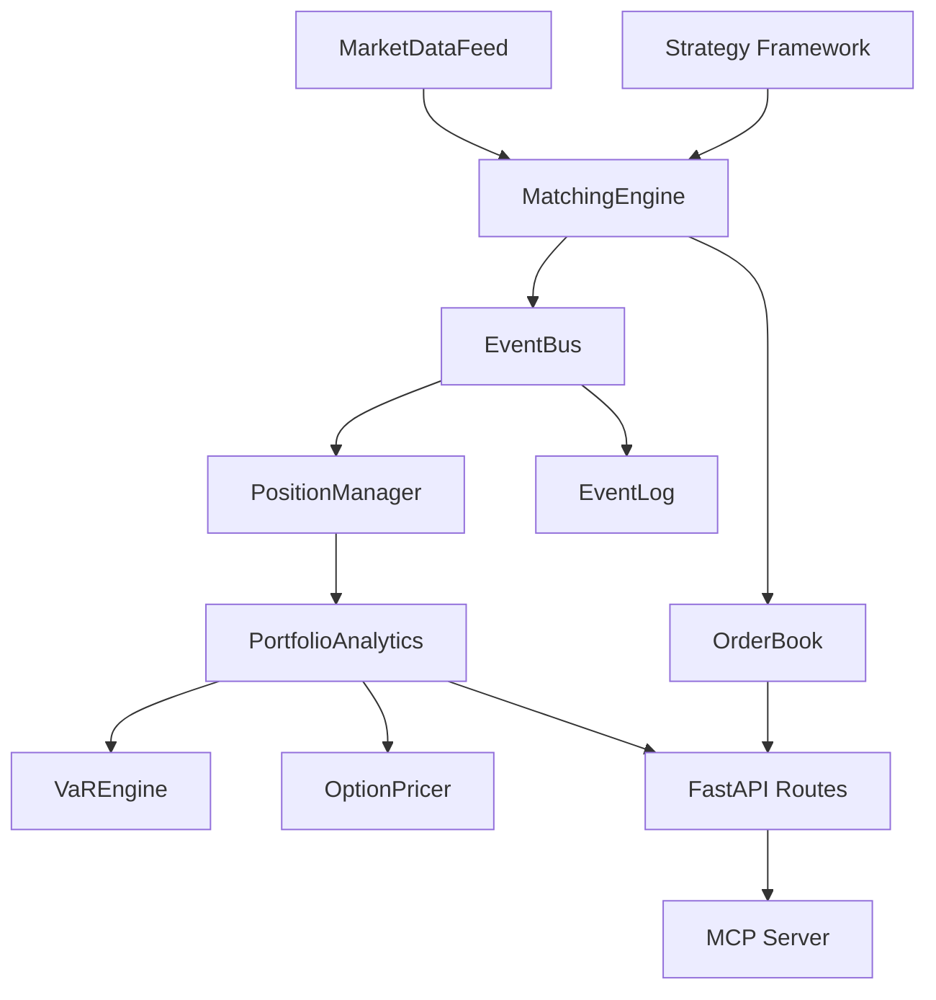

# Proctor Guide — Challenge 1: Code Comprehension

## Key Answers

### Architecture Overview

QuantCore is a **quantitative trading engine** with:
- **Core** (`qxm/core/`): Order matching engine, order book (FIFO with SortedDict), event sourcing (EventBus/EventLog), domain models (Pydantic v1)
- **Risk** (`qxm/risk/`): Value at Risk (parametric, historical, conditional), Black-Scholes Greeks with descriptor caching, portfolio analytics with operator overloading
- **Data** (`qxm/data/`): GBM-simulated market data feed (async generator), SQLAlchemy time-series store, OHLC/VWAP/EMA transforms
- **Strategy** (`qxm/strategy/`): Metaclass-based auto-registration, momentum (Donchian/EMA crossover), mean reversion (Bollinger/stat arb)
- **Auth** (`qxm/auth/`): HMAC-SHA256 request signing with replay protection, API key management
- **API** (`qxm/api/`): FastAPI REST endpoints with middleware
- **MCP** (`qxm/mcp_server/`): Model Context Protocol server with 8 tools

### Advanced Python Patterns (Expected Answers)

| Pattern | File | What Attendees Should Find |
|---------|------|---------------------------|
| Metaclass | `strategy/base.py` | `StrategyMeta` auto-registers strategy classes into `_registry` dict |
| Descriptor | `risk/greeks.py` | `CachedGreek` implements `__set_name__`, `__get__` with cache invalidation via `_param_hash` |
| `__slots__` | `core/models.py` | `Tick` class uses `__slots__` for memory efficiency on high-frequency data |
| Async generator | `data/feed.py` | `MarketDataFeed.stream()` yields ticks using `async for` |
| Protocol | `core/engine.py` | `PreTradeRiskCheck` — structural subtyping for risk check pluggability |
| Operator overloading | `risk/portfolio.py` | `PortfolioAnalytics.__add__`, `__sub__`, `__mul__` for portfolio combination |
| Event sourcing | `core/events.py` | `EventLog.replay()` rebuilds state from append-only log; `EventBus` with pub/sub |

### Data Flow (Expected Answer)

```
Market Data (GBM Simulator)
    → MarketDataFeed (async generator)
    → MatchingEngine (FIFO order matching)
    → EventBus (publishes TRADE_EXECUTED, ORDER_FILLED)
    → PositionManager (updates positions, P&L)
    → PortfolioAnalytics (VaR, Greeks aggregation)
    → API / MCP Server (serves to dashboard/clients)
```

## Prompts That Work Well

### For architecture overview:
```
Explain the architecture of this Python project. What are the main modules, 
how do they interact, and what design patterns are used?
```

### For specific pattern explanation:
```
Explain the StrategyMeta metaclass in qxm/strategy/base.py. What does it do, 
why is it used instead of a simpler approach, and how does auto-registration work?
```

```
Explain the CachedGreek descriptor in qxm/risk/greeks.py. How does the caching 
mechanism work and when does the cache get invalidated?
```

### For data flow:
```
Trace the lifecycle of an order from submission to trade execution in this 
codebase. What functions and classes are involved?
```

## Common Attendee Questions

**Q: "What's a metaclass?"**
A: A class that creates classes. `StrategyMeta.__init_subclass__` runs whenever someone creates a new class inheriting from `BaseStrategy`, automatically adding it to a registry dict. This is how the strategy framework discovers strategies without explicit registration.

**Q: "What's a descriptor?"**
A: An object with `__get__`/`__set__` that intercepts attribute access on a class. `CachedGreek` computes expensive BSM calculations once and caches them, re-computing only when underlying parameters change (detected via `_param_hash`).

**Q: "What's a Protocol class?"**
A: Structural subtyping (duck typing with type checking). `PreTradeRiskCheck` says "any class with a `check(order, position) -> bool` method" — no inheritance required.

**Q: "Why event sourcing?"**
A: Instead of storing just current state, we store every event. `EventLog.replay()` can rebuild the entire system state from scratch — essential for audit trails and debugging in trading systems.

## Stretch Goal Answers

### Mermaid Diagram (Expected Output)



### Test Coverage Gaps
Attendees should identify:
- No tests for `qxm/data/` module
- No tests for `qxm/strategy/` module
- No tests for `qxm/api/` module
- No integration tests
